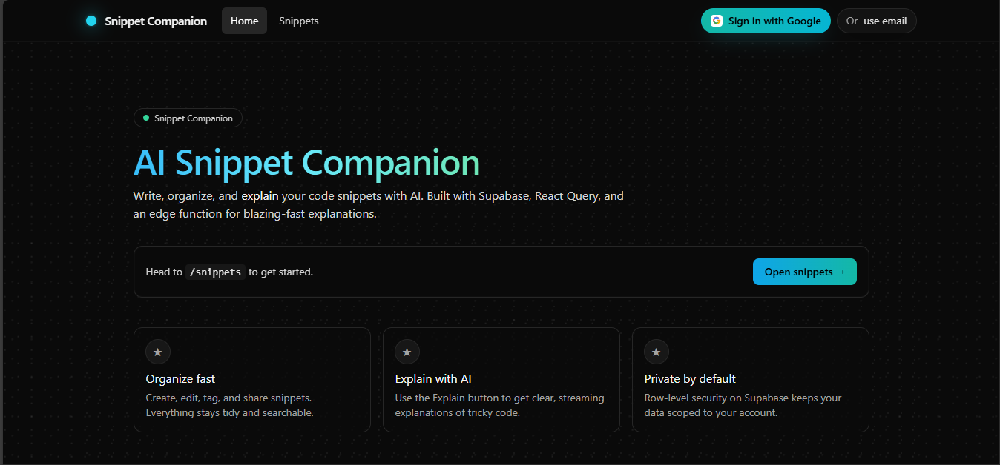
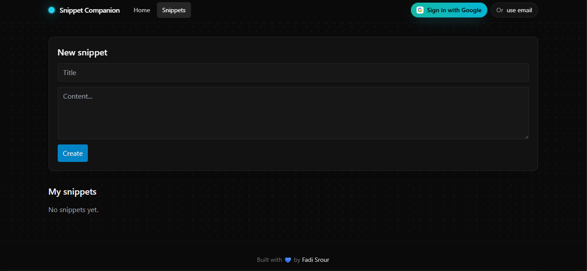
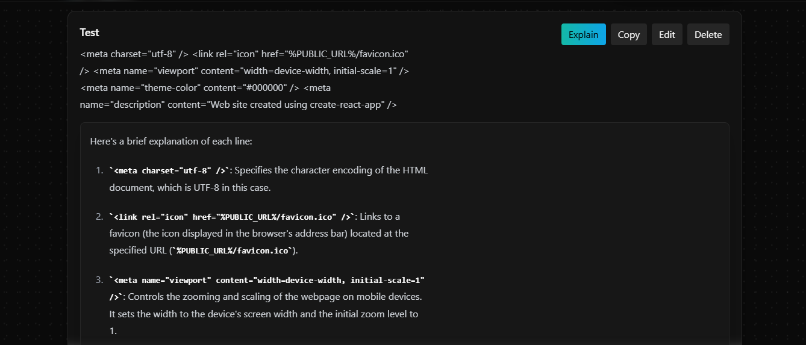

AI Snippet Companion

Store code snippets, explain them with AI (GROQ via Supabase Edge Functions), edit, copy, and share—wrapped in a sleek, minimal UI.

Built with 💙 by Fadi Srour

✨ Features

🧩 Snippets CRUD — create, edit, delete, copy

🔐 Auth — Google OAuth + Email magic link (Supabase Auth)

🧠 Explain with AI — GROQ via Supabase Edge Function (streaming & non-stream)

📝 Markdown — react-markdown + remark-gfm (+ rehype-sanitize for safety)

⚡ React Query — fast, cached data fetching

🎨 UI — Tailwind CSS, glass surfaces, animated detail touches

🧱 Security — RLS on snippets table, no secrets in client bundle

🔴 Live

Live demo: -------

Replace with your deployed URL (Vercel/Netlify/etc.).

🖼️ Screenshots:
Screenshots of Home, Snippets pages and a test for AI explanation.

	
🧱 Tech Stack

Frontend: Vite, React, TypeScript, Tailwind

State/Data: @tanstack/react-query

Markdown: react-markdown, remark-gfm, rehype-sanitize

Backend: Supabase (Auth, Postgres, Edge Functions)

AI: GROQ (served from Supabase Edge Function)

Tooling: ESLint, Vitest (optional), GitHub Actions CI

🚀 Quick Start
# 1) Install
cd apps/web
cp .env.example .env     # fill the values below
npm i

# 2) Dev
npm run dev

# 3) Build & preview
npm run build
npm run preview

.env (do not commit):

VITE_SUPABASE_URL=https://YOUR_PROJECT.supabase.co
VITE_SUPABASE_ANON_KEY=YOUR_ANON_KEY

Put real values in .env, keep .env.example in the repo.

🗄️ Database (Supabase)

Table:

create table if not exists public.snippets (
  id         uuid primary key default gen_random_uuid(),
  user_id    uuid not null,
  title      text not null,
  content    text not null,
  tags       text[] default '{}'::text[],
  is_public  boolean default false,
  created_at timestamptz not null default now()
);

RLS:

alter table public.snippets enable row level security;

drop policy if exists "snippets_select_own" on public.snippets;
drop policy if exists "snippets_insert_own" on public.snippets;
drop policy if exists "snippets_delete_own" on public.snippets;
drop policy if exists "snippets_update_own" on public.snippets;
drop policy if exists "snippets_select_public" on public.snippets;

create policy "snippets_select_own"   on public.snippets for select using (auth.uid() = user_id);
create policy "snippets_select_public" on public.snippets for select using (is_public);
create policy "snippets_insert_own"   on public.snippets for insert with check (auth.uid() = user_id);
create policy "snippets_update_own"   on public.snippets for update using (auth.uid() = user_id) with check (auth.uid() = user_id);
create policy "snippets_delete_own"   on public.snippets for delete using (auth.uid() = user_id);

⚙️ Edge Function (GROQ)

Deploy your function (example: explain-snippet):

# CLI auth & link once
supabase login
supabase link --project-ref <your-project-ref>

# Secrets (do NOT put GROQ key in .env)
supabase secrets set GROQ_API_KEY=sk_...

# Deploy
supabase functions deploy explain-snippet

CORS headers (example):

return new Response(body, {
  headers: {
    "Access-Control-Allow-Origin": "https://your-live-url-here.com", // dev: http://localhost:5173
    "Vary": "Origin",
    "Cache-Control": "no-store",
    "Content-Type": stream ? "text/event-stream" : "application/json",
  },
});

🔐 Auth Redirects

In Supabase → Authentication → URL Configuration:

Site URL: your live URL (e.g., https://your-live-url-here.com)

Redirect URLs:
https://your-live-url-here.com/snippets
http://localhost:5173/snippets (dev)

📦 Project Scripts

npm run dev — start local dev server

npm run build — production build

npm run preview — preview the build

npm run typecheck — TS project check

npm run test — tests (if enabled)

🧪 CI (GitHub Actions)

.github/workflows/ci.yml:

name: CI
on: [push, pull_request]
jobs:
  build:
    runs-on: ubuntu-latest
    defaults:
      run:
        working-directory: apps/web
    steps:
      - uses: actions/checkout@v4
      - uses: actions/setup-node@v4
        with: { node-version: '20' }
      - run: npm ci
      - run: npm run typecheck
      - run: npm run build

🔒 Security Notes

RLS is enabled on snippets

Markdown is sanitized with rehype-sanitize

Do not expose server/API keys in client

Supabase anon key is public but still keep it in .env

GROQ key must live in Supabase function secrets

🗺️ Roadmap

 Public snippet sharing pages

 Tag filtering & search

 Snippet folders / collections

 Better diff view for edits

 Keyboard shortcuts (Cmd/Ctrl + K, etc.)

🧑‍💻 Contributing

PRs welcome! Please open an issue to discuss major changes.

📝 License

MIT © 2025 Fadi Srour
